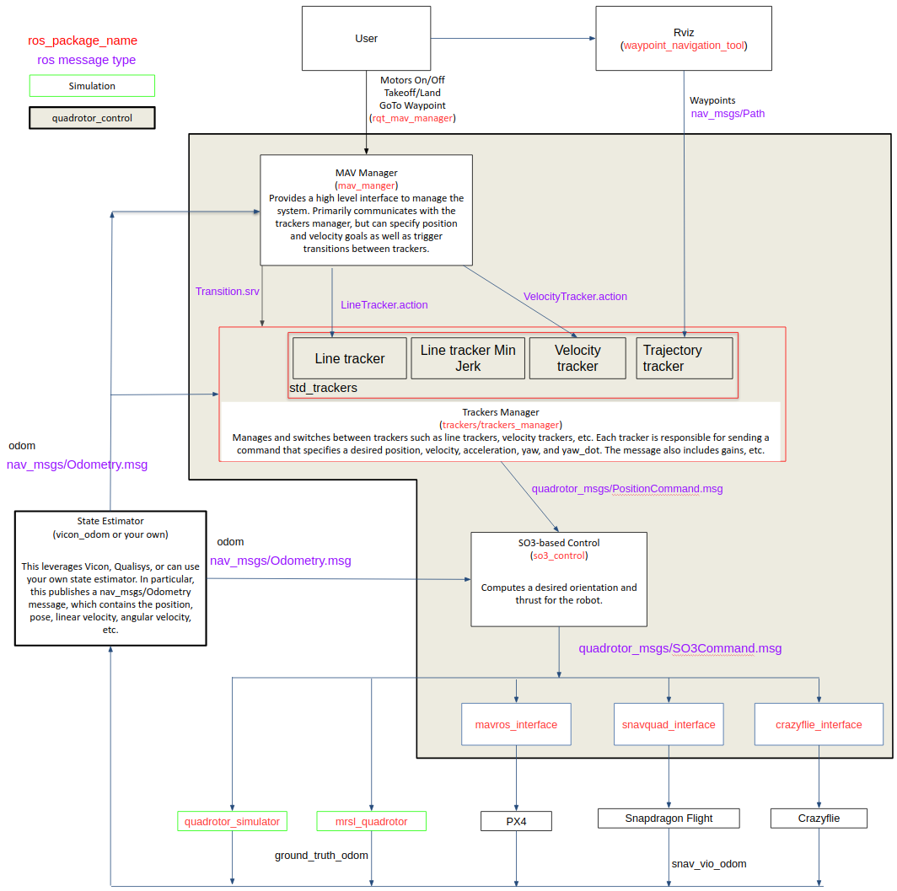

kr_mav_control
=================

ROS 2 packages for quadrotor control

### Stack includes:

  - `kr_mav_manager`: A manager for the kr_mav_control stack
  - `rqt_mav_manager`: GUI interface for common kr_mav_manager functions
  - `interfaces`: Translates `kr_mav_msgs/SO3Command` to corresponding robots interface.
  - `kr_quadrotor_simulator`: Simple quadrotor dynamics simulator
  - `kr_mav_msgs`: Common msgs used across packages
  - `kr_mav_controllers`: Position controllers
  - `trackers`: Different trackers under `kr_trackers`, and `kr_trackers_manager`

This code has been tested with ROS 2 Humble on Ubuntu 22.04.

### Block Diagram

The following block diagram shows how the packages in the repo fit together.

Further detailed breakdown of the blocks can be found in the [PPT](doc/kr_mav_control_block_diagram.pptx).
