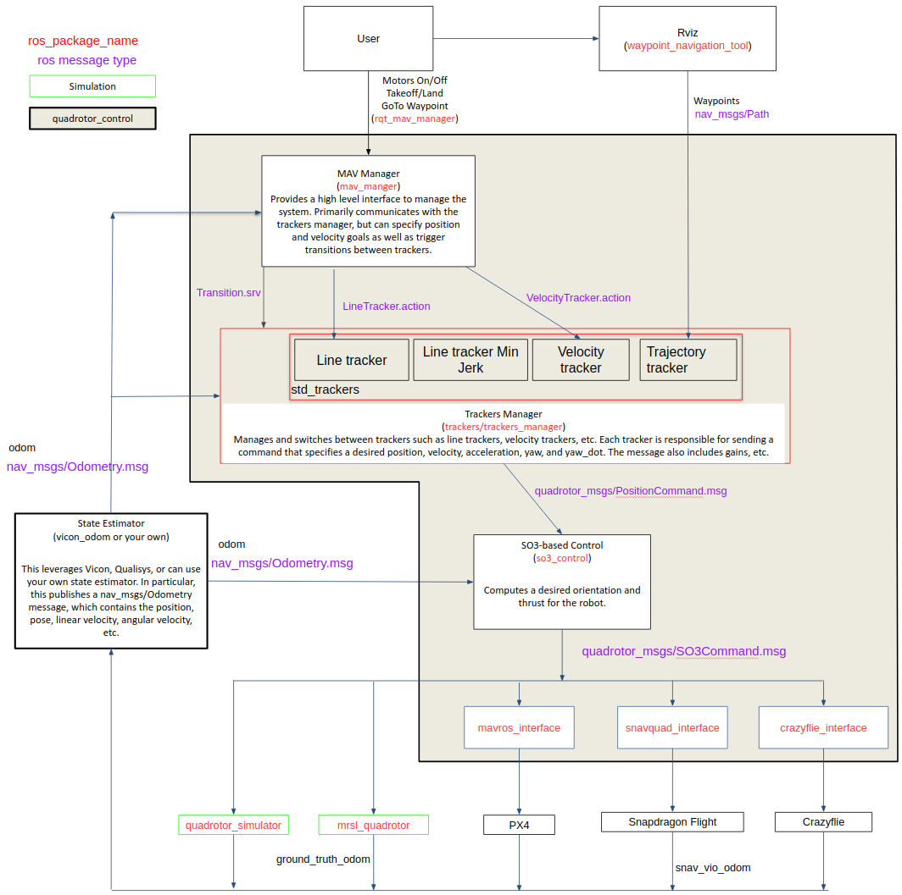

quadrotor_control
=================

ROS packages for quadrotor control

**Note:** There are packages that require submodules, you need to initialize the submodules by running the following in the repository directory:
```bash
git submodule init
git submodule update
```

### Block Diagram

The following block diagram shows how the packages in the repo fit together.



### Example usage

[Running with the included simple simulator](doc/QuadSim.md)
[Running with Gazebo](doc/QuadGazebo.md)
